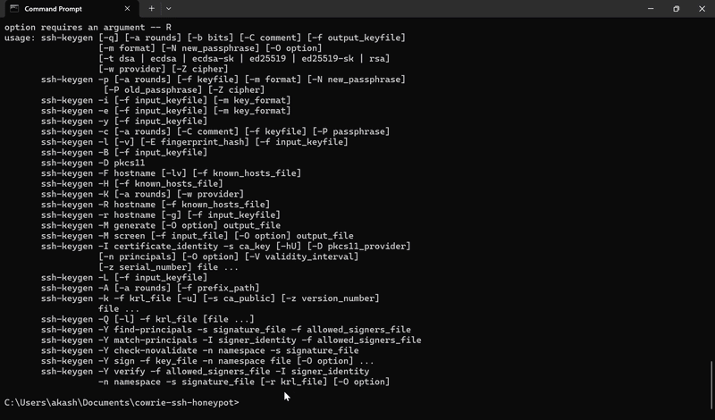
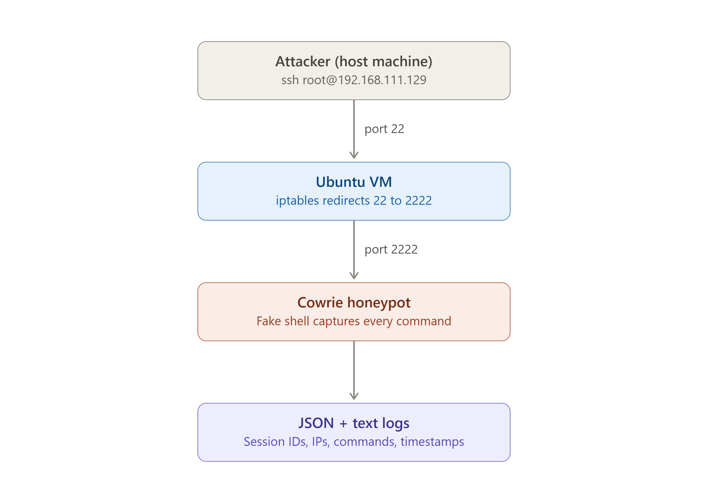
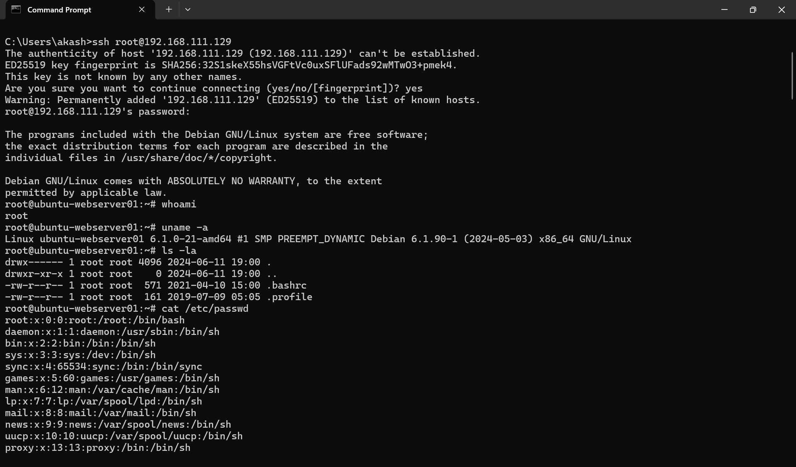
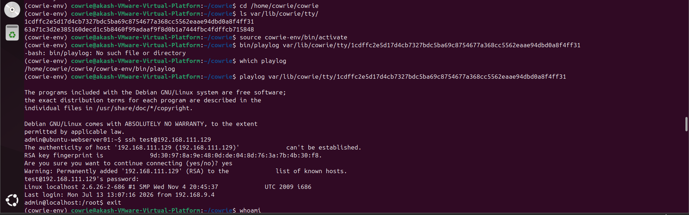
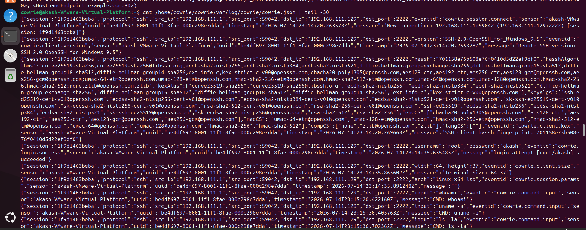

# SSH Honeypot with Cowrie — Threat Detection Lab

## Table of Contents
- [Overview](#overview)
- [Architecture](#architecture)
- [What I Did](#what-i-did)
- [Skills Demonstrated](#skills-demonstrated)
- [Key Findings](#key-findings)
- [Screenshots](#screenshots)
- [Challenges & Lessons Learned](#challenges--lessons-learned)
- [Future Improvements](#future-improvements)
- [Tools Used](#tools-used)

## Overview
A deployed and monitored SSH honeypot using [Cowrie](https://github.com/cowrie/cowrie)
to capture and analyze unauthorized login attempts and attacker behavior,
simulating real-world SOC log analysis workflows.

## Demo

*A simulated attacker logging into the honeypot and running commands, captured live*

## Architecture

## What I Did
- Deployed Cowrie (v3.0.6) on a dedicated, non-root Linux user for security best practice
- Configured `iptables` to redirect port 22 → Cowrie's listener on port 2222
- Generated and captured multiple simulated attack sessions from a separate host machine
- Analyzed structured JSON logs for credentials attempted and commands run
- Replayed attacker TTY sessions using Cowrie's `playlog` tool
- Documented findings on attacker behavior patterns

## Skills Demonstrated
Linux system administration, network configuration (NAT networking), `iptables`/NAT
port redirection, log analysis, understanding of attacker TTPs (Tactics, Techniques,
Procedures), and real-world troubleshooting of a live deployment.

## Key Findings
Full write-up: [analysis/findings.md](analysis/findings.md)

I ran 3 separate simulated SSH sessions (root, admin, test credentials), all
accepted by the honeypot. Commands run included system fingerprinting
(`whoami`, `uname -a`), reconnaissance (`cat /etc/passwd`, `ls -la`), and a
simulated payload download (`wget`) — mirroring real-world attacker behavior.
The structured JSON log captured session IDs, source IPs/ports, exact
timestamps, and file hashes — the same format a SIEM tool would ingest for
correlation and alerting.

## Screenshots

*Fake SSH session showing an attacker's commands being captured*

*Replaying a full attacker session keystroke-by-keystroke using `playlog`*

*Structured JSON logs ready for SIEM ingestion*

## Challenges & Lessons Learned
Real deployments rarely go exactly as documented, and this project was no
exception — working through these issues built practical troubleshooting
skills:
- The newer Cowrie release (v3.0.6) restructured its file layout — config
  templates moved from `etc/` to `src/cowrie/data/etc/`, and the old
  `bin/cowrie` script was replaced by a pip-installed `cowrie` command.
  Diagnosed this using `git ls-tree` to inspect the actual repository
  contents rather than assuming the documentation matched the installed version.
- After redirecting port 22 to Cowrie, admin file transfers (`scp`) were
  unexpectedly also routed into the honeypot — a good reminder that a
  honeypot redirect affects *all* traffic to that port, including your own.
  Solved by temporarily removing the redirect for legitimate admin access,
  then restoring it afterward.
- Learned to distinguish user-permission issues (`cowrie` user vs. sudo user)
  when files were locked behind Linux's home-directory permissions.

## Future Improvements
- Forward Cowrie's JSON logs to a Splunk instance for real-time alerting and
  dashboarding (SPL queries for top attacker IPs, most common credentials)
- Add a Windows/Active Directory detection lab to broaden detection coverage
  beyond Linux/SSH
- Automate the deployment with a shell script or Ansible playbook for
  repeatable setup

## Tools Used
Cowrie, VMware Workstation, Ubuntu Server 24.04, iptables, Python/pip, Git